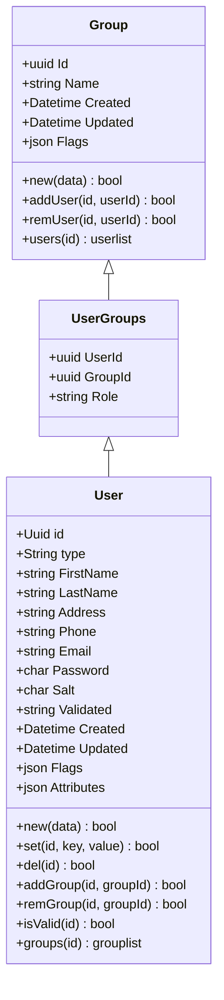
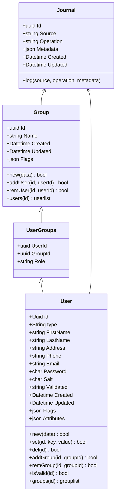
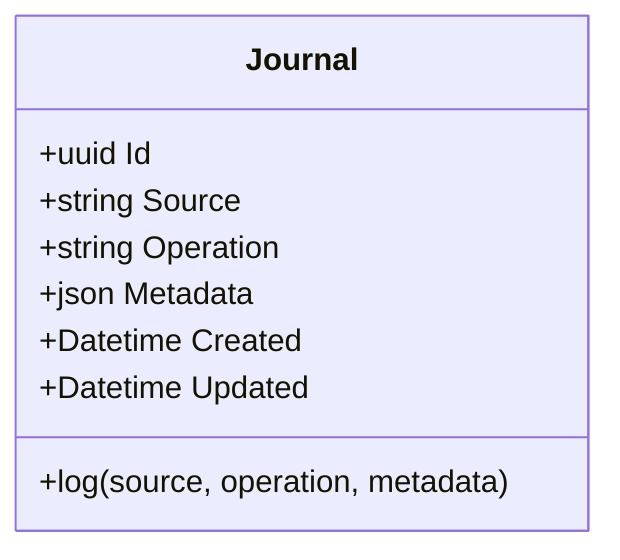

# Database Schemas
On this page:
[[toc]]

## User

- A user can be part of one or more groups

## Full Text Index

- Search platform contains all information necessary to search and navigation
- Other data and content are stored in a relational database

## Event log
- The event log (or journal) logs activity wherever necessary
- Internal and external dashboards allow for transparent tracking of activity 
- Fully anonymised

