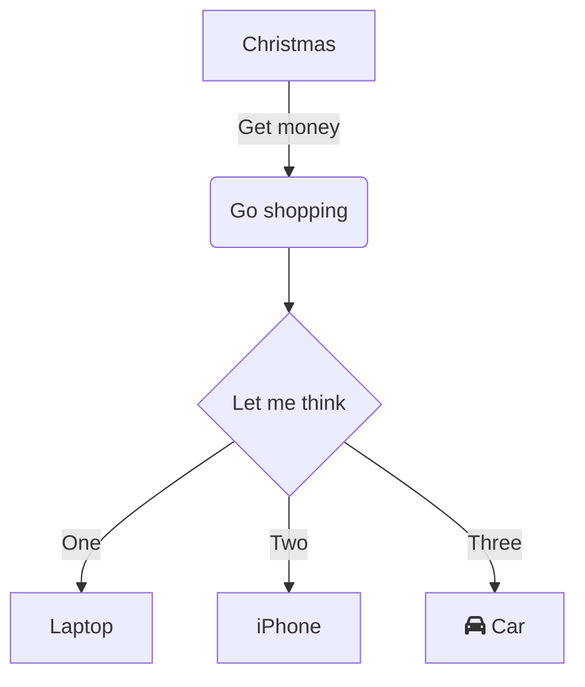
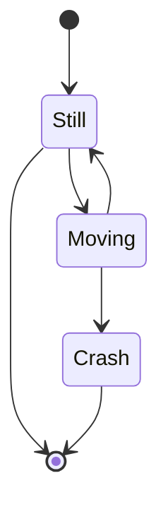
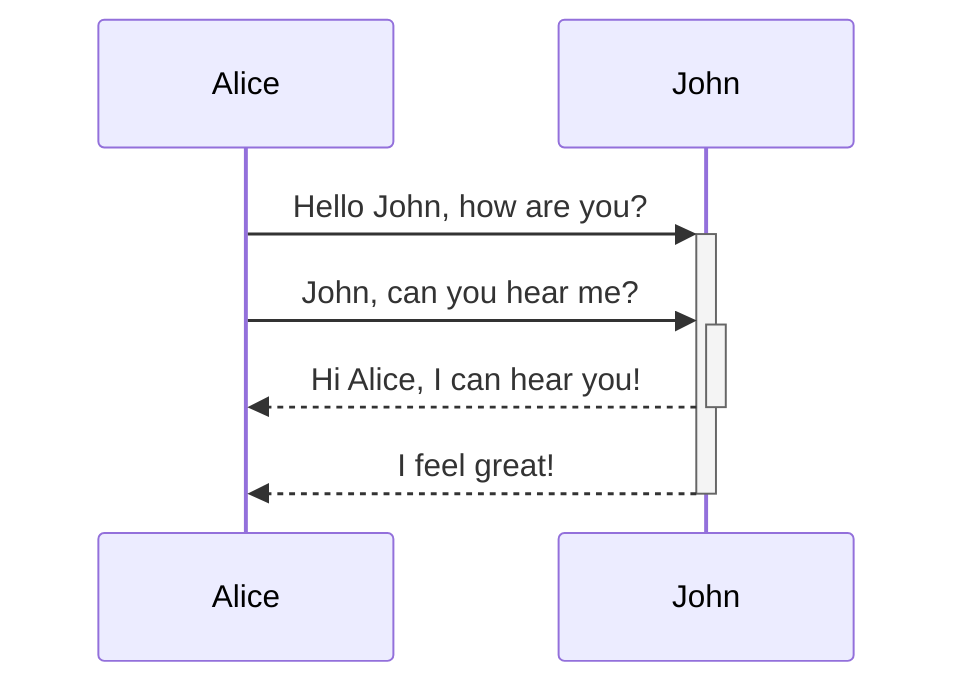
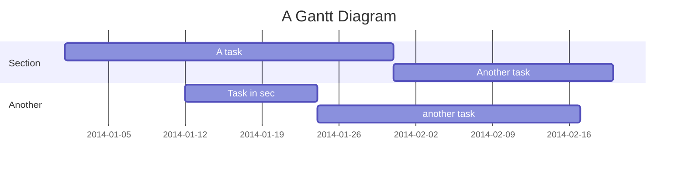
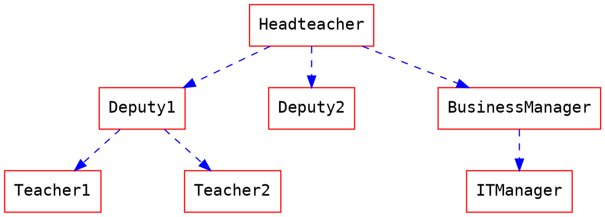
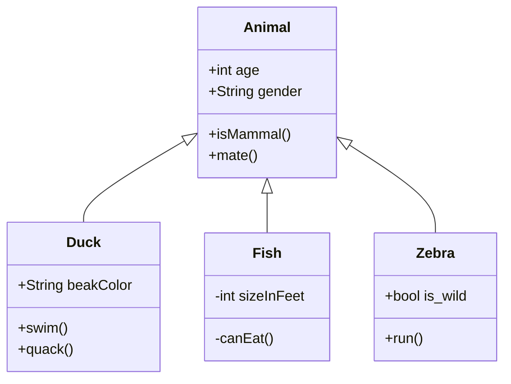

# Demonstration
Demonstration of what can be written and displayed by the specification.

Included plugins:
* [flowchart.js](https://flowchart.js.org/)
* [mermaid.js](http://mermaid-js.github.io/mermaid/)
* [Graphviz](https://graphviz.org/)
* [MathJax](https://www.mathjax.org/)

## Alerts

::: tip
Yes :tada:
:::

::: tip Message
This is a message 
:::

::: warning
Watch out :zap:
:::

::: danger
Oh No! :fire:
:::

## Flow Chart
Façon flowchart.js
@flowstart
st=>start: Start
e=>end: End
op=>operation: My Operation
op2=>operation: lalala
cond=>condition: Yes or No?

st->op->op2->cond
cond(yes)->e
cond(no)->op2
@flowend

Façon mermaid

### State

            

### Sequences

### Gantt

            
## Math

$$\Phi (y) = \frac {1} {2 \pi i} \int_{2 - i \infty}^{2 + i \infty} \frac {y^{\omega} \mathrm{d} \omega} {\omega \left(1 + \frac {\omega} {(\log x)^{1.1}}\right)^{[ \log x ] + 1}}, x > 1$$

> More information about **LaTeX** mathematical expressions [here](http://meta.math.stackexchange.com/questions/5020/mathjax-basic-tutorial-and-quick-reference).
            

### Hierarchy

### Classes

